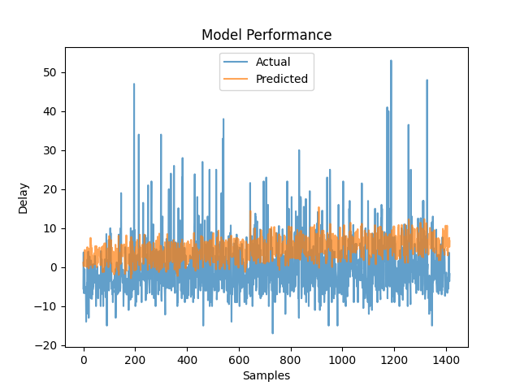
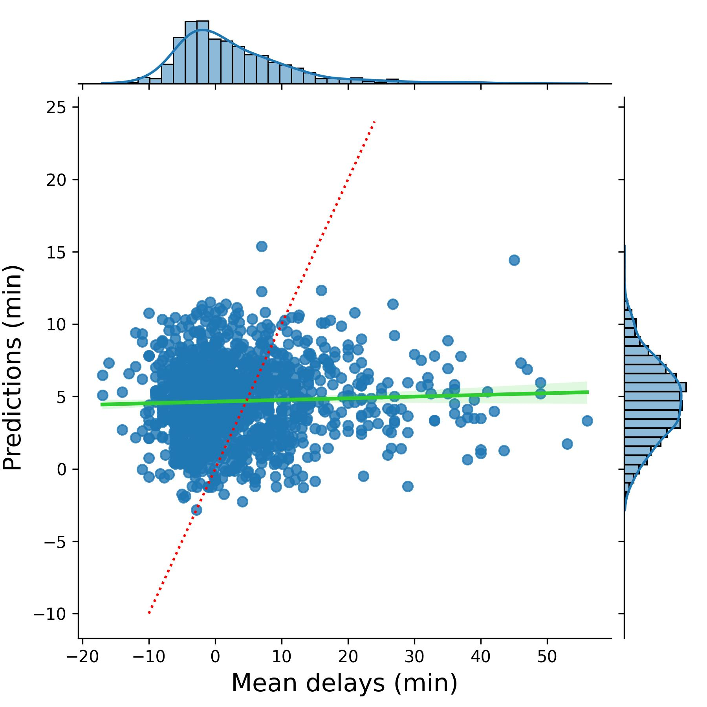

# Flight Delay MLOps Pipeline

## Overview
This project builds an end-to-end machine learning workflow for predicting average departure delay in minutes for flights leaving a selected origin airport. It combines data preparation, DVC-based data versioning, MLflow experiment tracking, a FastAPI prediction service, unit tests, and deployment-oriented assets.

## Coursework Context
This project was completed as part of my M.S. in Data Analytics program at Western Governors University (WGU).

## Project Goal
Create a reproducible pipeline that prepares airline on-time data, trains a delay prediction model, logs experiments, and serves predictions through an API.

## Pipeline Summary
1. Import and format airline on-time performance data
2. Filter the dataset to departures from Atlanta
3. Clean the data by removing missing departures, removing duplicates, and standardizing spacing
4. Train a Ridge regression model using encoded destination airports plus departure and arrival times
5. Track experiments, metrics, parameters, and artifacts in MLflow
6. Expose predictions through a FastAPI endpoint
7. Validate endpoint behavior with pytest

## Stack
- Python
- scikit-learn
- DVC
- MLflow
- FastAPI
- Docker
- GitLab CI/CD
- pytest

## Model
- Problem type: regression
- Algorithm: Ridge regression
- Features: one-hot encoded destination airport, scheduled departure time, scheduled arrival time
- Alpha sweep: 20 values from 0.0 to 3.8
- Logged metrics: mean squared error and average predicted delay

## Results
- Final test MSE: 82.51
- Average predicted delay: 4.68 minutes

## Selected Visuals

## API
### Endpoints
- `GET /`
- `GET /predict/delays`

### Example
`/predict/delays?dest_airport=LAX&departure_time=14:30&arrival_time=17:45`

## Testing
The copied test suite covers:
- valid request returns `200`
- invalid airport returns `400`
- invalid time format returns `400`
- missing required parameters returns `422`

## Reproducibility Notes
- The root-level deployment artifacts now include the original `airport_encodings.json` and `finalized_model.pkl` files used by the recovered GitLab-style API layout.
- The `src/` and `tests/` directories keep the cleaned portfolio structure used elsewhere in this repository.

## Notebooks
- `notebooks/flight_delay_pipeline.ipynb` — end-to-end data pipeline: imports and formats BTS on-time data, filters to Atlanta departures, cleans missing values and duplicates, trains Ridge regression, and evaluates on the test set
- `notebooks/flight_delay_mlflow_tracking.ipynb` — MLflow experiment tracking run: sweeps 20 alpha values, logs parameters, metrics, and the final model artifact

## Included Files
- `notebooks/flight_delay_pipeline.ipynb`
- `notebooks/flight_delay_mlflow_tracking.ipynb`
- `Dockerfile`
- `.gitlab-ci.yml`
- `deployment_api.py`
- `api_tests.py`
- `src/deployment_api.py`
- `src/airport_encodings.json`
- `src/finalized_model.pkl`
- `tests/api_tests.py`
- `data/cleaned_data.csv`
- `data/T_ONTIME_REPORTING.csv`
- `data/*.dvc`
- `.dvc/config`
- `.dvcignore`
- `.gitignore`
- `requirements.txt`
- `assets/model_performance_test.jpg`
- `assets/performance_plot.png`

## Note
This public portfolio repo keeps two parallel layouts for transparency:

- Root-level `Dockerfile`, `.gitlab-ci.yml`, `deployment_api.py`, `airport_encodings.json`, `finalized_model.pkl`, and `api_tests.py` preserve the original GitLab-style deployment artifacts restored from the original Task 3 coursework folder.
- The `src/` and `tests/` directories preserve the cleaned public portfolio structure used elsewhere in this repo.

An `MLproject` file — the YAML config MLflow uses to define entry points and run a project via `mlflow run` — is not included here. The MLflow work in this repo is demonstrated through the experiment tracking notebook rather than as a runnable MLflow Project, so the file isn't required to follow or reproduce the workflow.

---

*\* I used Claude (Anthropic) to help organize and stage this coursework into a GitHub portfolio repository. The analysis, code, and results are entirely my own.*